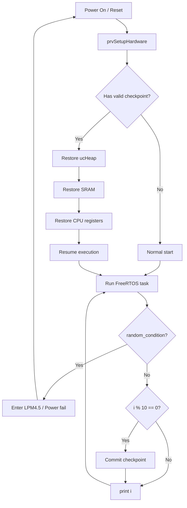

# FreeRTOS Lab - Checkpoint 作業引導

> 課程：FreeRTOS Lab 5  
> 主題：Implement checkpoint for FreeRTOS  
> 來源：`FreeRTOS Lab (checkpoint) - Google 簡報.pdf`

---

## 1. 作業目標

本 Lab 要在 FreeRTOS 上實作 **checkpoint 機制**。程式在執行過程中會定期儲存目前系統狀態，當發生斷電或進入低功耗狀態後，重新上電時可以從最近一次 checkpoint 繼續執行，而不是從頭開始。

核心目標是：

- 在 FRAM 中保留備份空間。
- 在 checkpoint commit 時備份必要狀態。
- 在重新開機後判斷是否需要 restoration。
- 能恢復 `ucHeap`、SRAM 與 CPU registers。
- 程式必須能承受 LPM4.5 測試與實際移除電源測試。

---

## 2. 程式大致流程

投影片給出的程式概念如下：

```c
main()
{
    prvSetupHardware();  // re-initialize I/O devices
    restore();           // restore a checkpoint if power fail

    // add test task & enable FreeRTOS scheduler ...
}

void test_task()
{
    while (i++)
    {
        if (random_condition())
            power_off();

        if (i % 10 == 0)
            commit();

        print(i);
    }
}
```

概念上，程式會持續執行一個測試 task。當 `i` 每累積到一定次數，例如每 10 次，就執行一次 `commit()` 儲存 checkpoint。若 `random_condition()` 成立，程式會模擬 power fail，之後重新開機時透過 `restore()` 回復狀態。

---

## 3. Checkpoint Commit 要做什麼

Checkpoint commit 是「儲存目前系統狀態」的動作。作業要求必須在 FRAM 中預留一塊 backup space，並且透過 `.cmd` 與 `.map` 檔確認記憶體配置。

commit 時要依照以下順序備份：

1. `ucHeap`
2. SRAM
3. CPU registers

### 3.1 為什麼要備份 ucHeap

FreeRTOS 的 task、queue、semaphore 等物件可能使用 heap 配置。如果只備份一般全域變數，FreeRTOS kernel 內部配置狀態可能遺失，導致 restore 後 scheduler 或 task 狀態不正確。

### 3.2 為什麼要備份 SRAM

SRAM 包含 `.bss` 與 `.data` 等執行期間會改變的資料，例如全域變數、靜態變數、部分 runtime 狀態。若沒有備份 SRAM，重開機後這些資料會被重新初始化，程式就無法真正從 checkpoint 繼續。

### 3.3 為什麼要備份 CPU registers

CPU registers 保存當下執行上下文，例如 stack pointer、program counter 或其他暫存器。若要恢復到 checkpoint 當下狀態，不能只恢復記憶體，也需要恢復 CPU 執行狀態。

---

## 4. Checkpoint Restoration 要做什麼

當 `random_condition()` 為 true 時，程式會進入 **LPM4.5** 模擬 power fail。接著按下 reset button 或重新供電後，程式會從 `main()` 重新開始。

重新啟動後要先判斷：

- 是否為第一次啟動？
- 是否是從 power fail 後恢復？
- 是否存在有效 checkpoint？

若是第一次啟動，不應該 restore。若確認是 power fail 後重新啟動，才執行 restoration。

restore 時要依照以下順序恢復：

1. `ucHeap`
2. SRAM
3. CPU registers

---

## 5. 雙份備份與有效 index

作業要求應該要有一個 index 指向目前哪一份 backup copy 是有效的。

也就是說，系統中可能保留兩份 checkpoint backup：

- Backup copy A
- Backup copy B

每次 commit 時可以交替寫入 A 或 B。完成備份後，再更新 index，表示目前哪一份是有效 checkpoint。

這樣做的理由是避免 commit 寫到一半時突然斷電。如果只有一份 backup，寫入過程中斷可能造成 checkpoint 損壞。雙份備份可以讓系統至少還有上一份完整資料可用。

---

## 6. Power Fail 測試方式

投影片建議使用 `rand()` 觸發 power fail，例如隨機進入 LPM4.5。不過要注意：power fail 間隔不能總是比 checkpoint commit 間隔短。

例如，如果設定每 10 次 commit 一次，但每 3 次就 power fail，程式可能永遠來不及 commit，導致停滯或測試無法前進。

因此 random power fail 的設計要確保：

- 有機會在 commit 後才 power fail。
- 不會永遠在下一次 commit 前斷電。
- restore 後程式能繼續印出遞增的 `i`。

---

## 7. 評分重點

作業明確要求：checkpoint commit 與 restoration 必須真的備份與恢復以下內容：

- SRAM，也就是 `.bss` 與 `.data`
- `ucHeap`
- CPU registers

若缺少任何一項，會被扣分。

特別注意，不能只備份測試用變數，例如只備份 `i`。這是負面範例，因為它不是完整 checkpoint，只是保存單一變數。

---

## 8. LPM4.5 與真正斷電

LPM4.5 是為了方便測試使用，但作業要求不只要通過 LPM4.5。程式也必須能在真正移除電源後存活。

也就是說，demo 時可能會測試：

- 程式執行中進入 LPM4.5 後 reset。
- 直接移除電源再重新供電。

因此 checkpoint 資料必須放在斷電後仍能保存的區域，例如 FRAM，而不能只放在會消失的 SRAM。

---

## 9. 建議實作檢查清單

實作時可以依照以下順序確認：

1. 確認 `.cmd` 記憶體配置，保留 FRAM backup space。
2. 從 `.map` 檔確認 `ucHeap`、`.bss`、`.data` 的實際位址與大小。
3. 實作 `commit()`，依序備份 `ucHeap`、SRAM、CPU registers。
4. 實作雙份 backup copy 與 valid index。
5. 實作 `restore()`，第一次啟動不 restore，power fail 後才 restore。
6. 使用 `rand()` 觸發 LPM4.5，但避免過度頻繁導致無法 commit。
7. 測試 reset button 後是否能從 checkpoint 繼續。
8. 測試真正移除電源後是否能恢復。

---

## 10. 簡化流程圖



---

## 11. 一句話總結

本 Lab 的重點不是只讓變數 `i` 看起來能繼續，而是要在 FreeRTOS 上實作真正的 checkpoint：把 heap、SRAM 與 CPU context 存到 FRAM，斷電後再正確恢復整個執行狀態。
